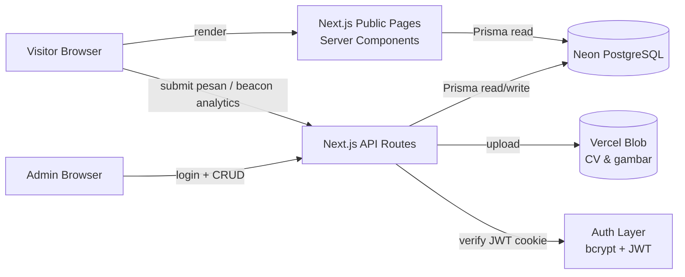
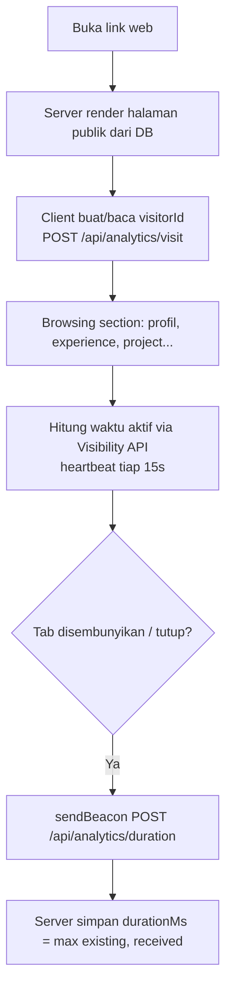
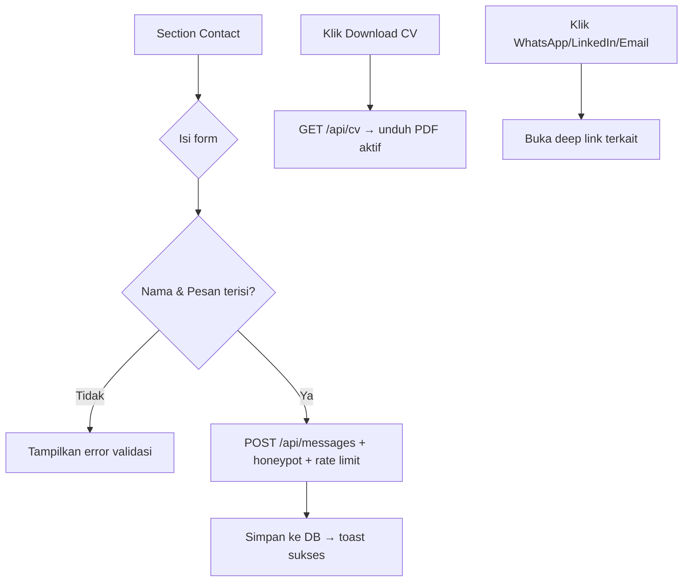

# PRD — Personal Portfolio Website

> **Status:** Draft v1.1
> **Jenis:** Full-stack web app (public portfolio + admin CMS)
> **Tema visual:** Dark + light-blue accent, modern, aesthetic, tidak kaku
> **Bahasa situs:** English (seluruh copy/UI publik & admin dalam bahasa Inggris). Dokumen PRD ini sendiri berbahasa Indonesia.
> **Tech stack:** Next.js 15 (App Router) · TypeScript · Tailwind CSS · shadcn/ui · Next.js API Routes · PostgreSQL · Prisma · Auth (Username/Password + bcrypt + JWT) · Vercel (hosting) · Neon (PostgreSQL)

---

## 1. Ringkasan Produk

Sebuah website portfolio pribadi yang **clean, responsif, dan modern**. Pengunjung umum yang membuka link langsung melihat portfolio (profil, pengalaman, project, kontak, dll.). Pemilik bertindak sebagai **admin tunggal**: lewat halaman admin terproteksi, ia dapat mengelola seluruh konten (tambah/edit/hapus pengalaman, project beserta link portfolio, skill, profil, CV, dan social link) tanpa menyentuh kode — perubahan langsung tampil di halaman publik.

Selain menampilkan konten, situs menyediakan: **kontak cepat** (WhatsApp, LinkedIn, Email), **form pesan** (pengunjung wajib mengisi nama), **download CV**, dan **visitor analytics** termasuk **durasi kunjungan (time on page)** yang dapat dipantau admin.

### 1.1 Tujuan
- Tampilan portfolio yang estetik dan adaptif di laptop maupun HP.
- Pemilik bisa memperbarui konten secara mandiri (self-service CMS) tanpa deploy ulang.
- Memudahkan orang menghubungi/menilai pemilik (kontak, pesan, CV).
- Memberi pemilik insight trafik & engagement (jumlah & durasi kunjungan).

### 1.2 Non-Goals (di luar scope v1)
- Multi-user / multi-admin atau registrasi publik (admin hanya satu, di-seed).
- Blog/CMS artikel panjang (fokus portfolio; bisa jadi enhancement).
- Multi-bahasa (i18n) — v1 **satu bahasa: English** (seluruh konten & UI berbahasa Inggris).
- E-commerce / pembayaran.
- Komentar publik pada project.

### 1.3 Persona
- **Visitor** (rekruter, klien, kolega): membaca portfolio, mengunduh CV, mengirim pesan.
- **Admin** (pemilik): login, mengelola konten, membaca pesan, memantau analytics.

---

## 2. Requirements

### 2.1 Functional Requirements

| ID | Requirement |
|----|-------------|
| FR-1 | Halaman publik menampilkan seluruh segment portfolio (Profile/Hero, About, Skills, Experience, Projects, FAQ, Contact) dari database. |
| FR-2 | Tampilan **responsif**: layout menyesuaikan otomatis untuk desktop, tablet, dan mobile. |
| FR-3 | Bagian kontak menampilkan **WhatsApp, LinkedIn, Email** yang dapat diklik (deep link wa.me / profil LinkedIn / mailto). |
| FR-4 | Pengunjung dapat mengirim **pesan teks**; field **Nama wajib diisi** (pesan tanpa nama ditolak). |
| FR-5 | Tersedia tombol **Download CV** yang mengunduh berkas CV aktif. |
| FR-6 | Sistem merekam **visitor analytics**: page view, unique visitor, referrer, perangkat, dan **durasi buka halaman (time on page)**. |
| FR-7 | Admin dapat **login** (username + password) ke area `/admin` yang terproteksi. |
| FR-8 | Admin dapat **CRUD** Profile, Experience, Project (termasuk link portfolio), Skill, FAQ, Social link, dan mengganti CV. |
| FR-9 | Perubahan konten oleh admin **langsung tampil** di halaman publik. |
| FR-10 | Admin dapat **melihat daftar pesan** masuk dan menandai sudah dibaca. |
| FR-11 | Admin dapat **melihat dashboard analytics** (ringkasan kunjungan + durasi). |
| FR-12 | Visitor non-admin **tidak bisa** mengakses halaman/endpoint admin (redirect ke login / 401). |
| FR-13 | Visitor dapat **melihat durasi kunjungannya sendiri** (live time-on-page) di halaman sebagai elemen engagement; timer berhenti saat tab tidak aktif. |
| FR-14 | Tersedia section **FAQ statis** (tanpa AI): daftar pertanyaan-jawaban yang dikelola admin, dengan pencarian/filter berbasis *contains* (substring, case-insensitive). |
| FR-15 | Pada perangkat berkursor (desktop), **kursor diganti** menjadi kursor kustom bertema roket; otomatis nonaktif di perangkat sentuh dan saat `prefers-reduced-motion`. |
| FR-16 | Project dan Experience **tidak ditampilkan semua sekaligus**; hanya sejumlah awal yang tampil, sisanya dimuat lewat tombol **"View More"**. |
| FR-17 | Admin dapat **CRUD FAQ** (pertanyaan, jawaban, urutan, visible). |

### 2.2 Non-Functional Requirements

| ID | Requirement |
|----|-------------|
| NFR-1 | **Performa:** LCP < 2.5s; gambar dioptimasi via `next/image`; halaman publik di-render server (SSR/ISR) untuk SEO & kecepatan. |
| NFR-2 | **SEO:** metadata, Open Graph/Twitter card, sitemap, dan title/description dinamis dari konten profil. |
| NFR-3 | **Responsiveness:** mobile-first; breakpoint Tailwind (`sm/md/lg/xl`); tidak ada horizontal scroll di mobile. |
| NFR-4 | **Accessibility:** WCAG AA (kontras, focus state, alt text, navigasi keyboard, `prefers-reduced-motion`). |
| NFR-5 | **Keamanan:** password di-hash bcrypt; JWT di httpOnly cookie; endpoint admin terproteksi; input tervalidasi; rate limit pada login & form pesan. |
| NFR-6 | **Reliability di serverless:** koneksi Prisma aman untuk Vercel (pooled connection Neon + singleton client). |
| NFR-7 | **Privacy analytics:** data kunjungan anonim (tanpa PII), IP tidak disimpan mentah (hash atau tidak disimpan). |
| NFR-8 | **Maintainability:** seluruh kode TypeScript; validasi terpusat (zod); komponen UI konsisten via shadcn/ui. |

### 2.3 Asumsi & Keputusan yang Perlu Dikonfirmasi
> Beberapa hal tidak tercakup di stack awal; berikut keputusan default yang saya ambil:

1. **Penyimpanan berkas (CV & gambar project).** Stack belum menyebut object storage. **Rekomendasi:** gunakan **Vercel Blob** (selaras dengan hosting Vercel) untuk upload CV/gambar; simpan URL hasilnya di DB. *Alternatif tanpa Blob:* admin menempelkan URL eksternal (mis. Google Drive untuk CV, image hosting untuk gambar). PRD mengasumsikan **Vercel Blob**.
2. **Rate limiting di serverless.** In-memory tidak persisten di Vercel. **Rekomendasi:** Upstash Redis (Ratelimit) untuk login & form pesan; *alternatif:* throttle berbasis tabel di PostgreSQL.
3. **Notifikasi email saat ada pesan baru.** Opsional; butuh provider email (mis. Resend). Default v1: pesan hanya tersimpan & terlihat di admin (tanpa email).
4. **Admin tunggal di-seed**, tanpa registrasi publik (lihat §6.3 & §7).
5. **Light/Dark toggle.** Default tema **dark** (sesuai brief "dark light blue"); toggle ke light mode bersifat opsional/enhancement.

---

## 3. Core Features

### 3.1 Public Portfolio (single-page, section-based)
Satu halaman scroll dengan navigasi anchor (smooth scroll). Seluruh copy berbahasa **Inggris**. Segment:
- **Hero / Profile** — nama, headline, tagline singkat, foto/avatar, CTA (Contact & Download CV), social icons.
- **About** — bio/ringkasan naratif.
- **Skills** — daftar skill dikelompokkan per kategori (Frontend/Backend/Tools).
- **Experience** — timeline pengalaman (role, perusahaan, periode, deskripsi). Menampilkan sejumlah awal + **"View More"** (lihat §3.7).
- **Projects** — grid kartu project dengan gambar, tag/tech, dan **link portfolio**; penanda *featured*. Menampilkan sejumlah awal + **"View More"** (lihat §3.7).
- **FAQ** — daftar tanya-jawab statis dengan pencarian (lihat §3.8).
- **Contact** — WhatsApp/LinkedIn/Email + form pesan.
- **Footer** — ringkas, copyright, link cepat.

Sebuah **session timer** kecil (live time-on-page) tampil non-intrusif di halaman sebagai elemen engagement (lihat §3.6).

### 3.2 Contact & Social Links
- WhatsApp → `https://wa.me/<nomor>`; LinkedIn → URL profil; Email → `mailto:`.
- Ditampilkan sebagai ikon + label, dikelola admin (bisa kosongkan yang tidak dipakai).

### 3.3 Message Form (nama wajib)
- Field: **Nama (wajib)**, Email (opsional, agar admin bisa membalas), **Pesan (wajib)**.
- Validasi sisi client & server (zod). Submit tanpa nama/pesan ditolak dengan pesan error jelas.
- Anti-spam: honeypot field tersembunyi + rate limit per IP. Pesan tersimpan ke DB, tampil di admin.
- Feedback sukses/gagal via toast.

### 3.4 CV Download
- Tombol "Download CV" mengunduh berkas aktif (PDF).
- Admin dapat meng-upload/replace CV; URL CV aktif tersimpan di profil. Endpoint `/api/cv` mengarahkan/menyajikan berkas terbaru.

### 3.5 Visitor Analytics (termasuk durasi kunjungan)
- Merekam tiap kunjungan: `visitorId` anonim, path, referrer, perangkat (mobile/desktop/tablet), waktu mulai, dan **durasi aktif (time on page)**.
- **Pengukuran durasi (desain):**
  1. Saat load, baca/buat `visitorId` (cookie first-party, masa berlaku ~1 tahun).
  2. Kirim event awal `POST /api/analytics/visit` → server membuat record `VisitSession` (durasi 0) dan mengembalikan `sessionId`.
  3. Client menghitung **waktu aktif** memakai **Page Visibility API** (hanya menghitung saat tab terlihat/fokus).
  4. Kirim *heartbeat* berkala (mis. tiap 15 dtk) dan **flush terakhir** saat `visibilitychange→hidden` / `pagehide` memakai `navigator.sendBeacon` ke `POST /api/analytics/duration` `{ sessionId, durationMs }`.
  5. Server menyimpan `durationMs = max(existing, received)` agar tidak dobel.
- **Dashboard admin** menampilkan: total page view, unique visitor, **rata-rata & distribusi durasi**, tren kunjungan per hari, breakdown perangkat, dan top referrer.
- Privasi: anonim, tanpa PII; IP tidak disimpan mentah.

### 3.6 Visitor-Visible Session Timer (engagement)
- Menampilkan **durasi kunjungan berjalan** ke visitor itu sendiri sebagai sentuhan engagement (mis. pill kecil "You've been exploring for 02:34" di pojok, atau di footer).
- **Memakai sumber data yang sama** dengan akumulator waktu aktif di §3.5 — tidak ada penghitungan ganda. Timer **pause saat tab tidak aktif** (konsisten dengan Page Visibility API) lalu lanjut saat kembali aktif.
- Non-intrusif: ringan, dapat di-dismiss/disembunyikan, dan tidak menutupi konten. Format mm:ss.
- *(Opsional)* tampilkan juga metrik agregat ramah-engagement seperti "Average visitor stays ~X min" yang diambil dari analytics — tandai opsional bila ingin menjaga kesederhanaan.

### 3.7 Progressive Disclosure — "View More" (Projects & Experience)
- Karena jumlah project/experience akan bertambah, halaman **tidak memuat semua sekaligus**.
- Render awal menampilkan **batch pertama** (mis. 6 project, 3 experience) di HTML server-side (baik untuk SEO & LCP); sisanya dimuat lewat tombol **"View More"**.
- **Mekanik:** "View More" memanggil endpoint publik berpaginasi (cursor/offset) — `GET /api/projects?cursor=` dan `GET /api/experiences?cursor=` — lalu meng-append hasil. Tampilkan state loading & "no more items" saat habis.
- Urutan mengikuti field `order` (lalu tanggal). Item *featured* diprioritaskan di batch pertama untuk project.

### 3.8 FAQ Statis (tanpa AI)
- Section berisi pertanyaan yang paling sering ditanyakan, dengan **jawaban statis** yang ditulis pemilik (bersumber dari konten profil/experience di atasnya) — **tidak memakai AI**.
- Tampilan **accordion** (expand/collapse). Disertai **kotak pencarian** yang memfilter berbasis *contains*: pencocokan **substring case-insensitive** terhadap `question` (dan opsional `answer`). Logika FAQ umum, ringan, sepenuhnya di client karena set data kecil.
- Konten dikelola admin (CRUD, urut, visible) — lihat §5.3 model `Faq` & §5.4.

### 3.9 Custom Cursor (roket)
- Pada perangkat **berkursor (desktop)**, kursor default diganti menjadi **kursor kustom bertema roket**.
- **Implementasi disarankan:** elemen pengikut (follower) yang mengikuti posisi mouse dengan easing halus + sedikit efek (mis. jejak/flame) agar terasa hidup, sementara kursor sistem disembunyikan (`cursor: none`) di area publik. Alternatif sederhana: `cursor: url(rocket.svg), auto` via CSS.
- **Batasan & aksesibilitas:**
  - **Nonaktif di perangkat sentuh** (tidak ada kursor) dan saat layar kecil.
  - Hormati **`prefers-reduced-motion`** → matikan animasi follower, fallback ke kursor default/statis.
  - Pastikan **afordans interaksi** tetap jelas (hover state pada link/tombol tetap terbaca); jangan ganggu fokus keyboard.
  - Sediakan **toggle "disable cursor effect"** kecil (mis. di footer) untuk kenyamanan.
  - Hanya di halaman publik; area `/admin` memakai kursor normal.

### 3.10 Admin CMS
- Login terproteksi; setelah masuk, admin mengelola seluruh konten lewat form (react-hook-form + zod), dengan drag/urut sederhana (`order`) untuk experience/project/skill/FAQ.
- Aksi: create, edit, delete, reorder, toggle *featured*/visible.
- Upload gambar project & CV (Vercel Blob).
- Kelola **FAQ** (pertanyaan/jawaban statis).
- Lihat & kelola pesan; lihat analytics.

---

## 4. Design / Frontend

### 4.1 Prinsip Desain
- **Clean & breathable:** banyak ruang kosong, hirarki tipografi tegas, konten mudah dipindai.
- **Dark + light-blue aesthetic:** latar gelap dengan aksen biru muda, sentuhan glow/gradien halus agar "tidak kaku".
- **Motion halus:** reveal saat scroll, hover lift pada kartu, transisi lembut; hormati `prefers-reduced-motion`.
- **Custom cursor (desktop):** kursor roket dengan follower beranimasi halus untuk nuansa playful — selalu tunduk pada aturan aksesibilitas di §3.9.
- **Bahasa:** seluruh label/copy UI dalam **bahasa Inggris**.
- **Konsistensi:** komponen dari shadcn/ui dengan token tema kustom.

### 4.2 Color Tokens (tema dark, contoh)
| Token | Nilai (acuan) | Penggunaan |
|-------|---------------|------------|
| `background` | Deep navy/slate (≈ `#0B1220`) | Latar utama |
| `surface` / card | Slate lebih terang (≈ `#111A2E`) | Kartu, panel |
| `border` | White @ ~8% opacity | Garis halus |
| `primary` (accent) | Light blue / sky (≈ `#38BDF8`) | CTA, link, highlight |
| `primary-foreground` | Navy gelap | Teks di atas accent |
| `foreground` | Slate-100 (≈ `#E2E8F0`) | Teks utama |
| `muted-foreground` | Slate-400 (≈ `#94A3B8`) | Teks sekunder |
| `glow` | Radial blue glow lembut | Aksen latar hero/section |

> Implementasi via CSS variables shadcn/ui (`--background`, `--primary`, dst.) agar konsisten. Mode dark sebagai default.

### 4.3 Tipografi & Aset
- Font: sans modern (mis. **Geist** atau **Inter**) untuk body; opsional display font untuk heading hero.
- Ikon: `lucide-react`. Ilustrasi/gambar via `next/image` (lazy + ukuran responsif).

### 4.4 Routes / Pages

| Route | Akses | Deskripsi |
|-------|-------|-----------|
| `/` | Publik | Single-page portfolio (semua section). SSR/ISR. |
| `/projects/[id]` | Publik (opsional) | Detail project bila butuh halaman tersendiri. |
| `/api/cv` | Publik | Unduh/redirect ke CV aktif. |
| `/admin/login` | Publik | Form login admin. |
| `/admin` | Admin | Dashboard ringkasan + analytics. |
| `/admin/profile` | Admin | Edit profil, social link, CV. |
| `/admin/experience` | Admin | CRUD + reorder pengalaman. |
| `/admin/projects` | Admin | CRUD + reorder project (link porto, gambar, tag). |
| `/admin/skills` | Admin | CRUD + reorder skill. |
| `/admin/faq` | Admin | CRUD + reorder FAQ (pertanyaan/jawaban statis). |
| `/admin/messages` | Admin | Daftar & detail pesan, tandai dibaca. |
| `/admin/settings` | Admin | Ganti password, preferensi. |

### 4.5 Breakdown Komponen (shadcn/ui)
**Layout publik**
- `Navbar` (sticky, anchor links, blur background; di mobile pakai `Sheet` untuk menu).
- `HeroSection`, `AboutSection`, `SkillsSection`, `ExperienceTimeline`, `ProjectGrid` + `ProjectCard`, `FaqSection`, `ContactSection`, `Footer`.
- `SocialLinks` (ikon WA/LinkedIn/Email), `CvDownloadButton`.
- `ContactForm` (`Form`, `Input`, `Textarea`, `Button`, `Sonner` toast).
- `FaqSection` — `Accordion` + `Input` pencarian (filter *contains* client-side).
- `ViewMoreButton` — memuat batch berikutnya untuk Projects/Experience (loading + "no more" state).
- `SessionTimer` — pill live time-on-page (engagement), pause saat tab hidden.
- `CustomCursor` — follower roket (desktop, hormati reduced-motion & touch), dengan toggle nonaktif.
- `ScrollReveal` wrapper (animasi masuk).

**Admin**
- `AdminShell` (sidebar + topbar), `DataTable` (`Table`), form-form (`Form`, `Input`, `Textarea`, `Select`, `Switch`), `Dialog`/`AlertDialog` (konfirmasi hapus), `FileUpload` (CV/gambar), `FaqManager`, `AnalyticsCards` + chart (line/donut), `MessageList`.

**State wajib:** loading (`Skeleton`), empty, error di setiap halaman.

### 4.6 Responsiveness
- Mobile-first; grid project `1 → 2 → 3` kolom mengikuti breakpoint.
- Navbar jadi hamburger (`Sheet`) di mobile; CTA tetap terlihat.
- Target sentuh ≥ 44px; tipografi skala fluida.

---

## 5. Backend

### 5.1 Arsitektur Tingkat Tinggi


### 5.2 Pola Backend
- **Baca konten publik:** dilakukan langsung di **Server Components** lewat Prisma (tanpa perlu GET API publik), dengan caching/ISR `revalidate`.
- **Mutasi & aksi:** lewat **Next.js API Routes** (`app/api/...`): login, CRUD admin, submit pesan, analytics beacon, CV.
- **PrismaClient singleton** untuk menghindari kehabisan koneksi di serverless.

### 5.3 Data Model (Prisma `schema.prisma`)
```prisma
datasource db {
  provider  = "postgresql"
  url       = env("DATABASE_URL")   // pooled (Neon) untuk runtime
  directUrl = env("DIRECT_URL")     // direct untuk migrate
}

generator client {
  provider = "prisma-client-js"
}

model AdminUser {
  id           String   @id @default(cuid())
  username     String   @unique
  passwordHash String                       // bcrypt
  createdAt    DateTime @default(now())
  updatedAt    DateTime @updatedAt
}

// Singleton: selalu 1 baris
model Profile {
  id        String   @id @default(cuid())
  fullName  String
  headline  String                          // mis. "Full-Stack Developer"
  tagline   String?                         // kalimat hero
  bio       String?  @db.Text               // About
  photoUrl  String?
  location  String?
  email     String?
  whatsapp  String?                         // nomor / link wa.me
  linkedin  String?
  github    String?
  cvUrl     String?                         // CV aktif (Vercel Blob)
  updatedAt DateTime @updatedAt
}

model Experience {
  id          String    @id @default(cuid())
  role        String
  company     String
  location    String?
  startDate   DateTime
  endDate     DateTime?                      // null = sampai sekarang
  isCurrent   Boolean   @default(false)
  description String?   @db.Text
  order       Int       @default(0)
  createdAt   DateTime  @default(now())
  updatedAt   DateTime  @updatedAt
}

model Project {
  id           String   @id @default(cuid())
  title        String
  description  String?  @db.Text
  portfolioUrl String?                       // link porto / demo
  repoUrl      String?
  imageUrl     String?                       // Vercel Blob
  tags         String[]                      // tech / kategori
  featured     Boolean  @default(false)
  isVisible    Boolean  @default(true)
  order        Int      @default(0)
  createdAt    DateTime @default(now())
  updatedAt    DateTime @updatedAt
}

model Skill {
  id       String  @id @default(cuid())
  name     String
  category String?                           // Frontend / Backend / Tools
  level    Int?                              // 1-5 (opsional)
  order    Int     @default(0)
}

// Opsional (enhancement)
model Education {
  id          String    @id @default(cuid())
  school      String
  degree      String?
  startDate   DateTime?
  endDate     DateTime?
  description String?   @db.Text
  order       Int       @default(0)
}

model Faq {
  id        String   @id @default(cuid())
  question  String
  answer    String   @db.Text                 // jawaban statis (ditulis admin)
  order     Int      @default(0)
  isVisible Boolean  @default(true)
  createdAt DateTime @default(now())
  updatedAt DateTime @updatedAt
}

model Message {
  id        String   @id @default(cuid())
  name      String                            // WAJIB
  email     String?
  content   String   @db.Text                 // WAJIB
  isRead    Boolean  @default(false)
  ipHash    String?                           // anti-spam (hash, bukan IP mentah)
  createdAt DateTime @default(now())
  @@index([createdAt])
}

model VisitSession {
  id         String   @id @default(cuid())
  visitorId  String                           // anonim (cookie)
  path       String
  referrer   String?
  device     String?                          // mobile/desktop/tablet
  country    String?                          // opsional (header geo Vercel)
  durationMs Int      @default(0)             // time on page (akumulasi aktif)
  startedAt  DateTime @default(now())
  @@index([visitorId])
  @@index([startedAt])
}
```

### 5.4 API Endpoints (kontrak)

**Publik**
| Method | Endpoint | Deskripsi |
|--------|----------|-----------|
| GET | `/api/projects?cursor=&limit=` | Batch project untuk "View More" (paginasi). |
| GET | `/api/experiences?cursor=&limit=` | Batch experience untuk "View More" (paginasi). |
| GET | `/api/faqs` | Daftar FAQ visible (dipakai bila perlu fetch client; bisa juga di-SSR). |
| POST | `/api/messages` | Kirim pesan `{ name*, email?, content*, _honeypot? }`. Validasi + rate limit. |
| POST | `/api/analytics/visit` | Mulai sesi kunjungan → kembalikan `sessionId`. |
| POST | `/api/analytics/duration` | Update durasi `{ sessionId, durationMs }` (dipanggil via `sendBeacon`). |
| GET | `/api/cv` | Redirect/serve CV aktif. |

**Auth & Admin (terproteksi)**
| Method | Endpoint | Deskripsi |
|--------|----------|-----------|
| POST | `/api/auth/login` | Verifikasi username+password (bcrypt) → set JWT httpOnly cookie. |
| POST | `/api/auth/logout` | Hapus cookie sesi. |
| GET/PUT | `/api/admin/profile` | Baca/perbarui profil + social link + cvUrl. |
| GET/POST | `/api/admin/experiences` · PUT/DELETE `/api/admin/experiences/[id]` | CRUD pengalaman. |
| GET/POST | `/api/admin/projects` · PUT/DELETE `/api/admin/projects/[id]` | CRUD project. |
| GET/POST | `/api/admin/skills` · PUT/DELETE `/api/admin/skills/[id]` | CRUD skill. |
| GET/POST | `/api/admin/faqs` · PUT/DELETE `/api/admin/faqs/[id]` | CRUD FAQ. |
| POST | `/api/admin/upload` | Upload CV/gambar ke Vercel Blob → kembalikan URL. |
| GET | `/api/admin/messages` · PATCH `/api/admin/messages/[id]` | List pesan / tandai dibaca. |
| GET | `/api/admin/analytics` | Agregasi kunjungan & durasi untuk dashboard. |
| PUT | `/api/admin/password` | Ganti password admin. |

> Semua endpoint `/api/admin/**` dan halaman `/admin/**` (kecuali `/admin/login`) wajib memvalidasi JWT; gagal → 401 / redirect login.

### 5.5 Authentication & Authorization
- **Login:** username dicocokkan, password diverifikasi `bcrypt.compare`. Sukses → buat **JWT** (klaim minimal: `sub`, `role: "admin"`, `exp`) ditandatangani `JWT_SECRET`, disimpan di **cookie httpOnly + Secure + SameSite=Lax**.
- **Proteksi:** `middleware.ts` mencegat `/admin/**` & `/api/admin/**`, verifikasi JWT; invalid → redirect/401.
- **Admin tunggal:** tidak ada registrasi publik. Akun dibuat lewat **seed script** memakai `ADMIN_USERNAME` + password yang di-hash (lihat §7 deployment).
- **CSRF:** mutasi memakai cookie SameSite=Lax + verifikasi origin; pertimbangkan token CSRF untuk form admin.
- **Rate limit:** login & `/api/messages` dibatasi per IP (Upstash Ratelimit / throttle DB).

### 5.6 Integrasi Neon (PostgreSQL) & Prisma
- Runtime memakai **pooled connection string** Neon (`DATABASE_URL`, pgBouncer) agar aman di serverless; migrasi memakai `DIRECT_URL`.
- `prisma generate` di build; `prisma migrate deploy` saat release.
- `PrismaClient` sebagai singleton global (hindari instansiasi berulang di hot reload/serverless).

### 5.7 Caching & Revalidation
- Halaman publik di-render dengan ISR (`revalidate`) atau di-revalidate **on-demand** setelah admin menyimpan perubahan (mis. `revalidatePath('/')`), sehingga update tampil cepat tanpa over-fetch.
- **View More:** batch pertama Projects/Experience ikut di-SSR (baik untuk SEO & LCP); batch berikutnya diambil client lewat `/api/projects` & `/api/experiences` (paginasi cursor/offset). FAQ kecil bisa di-SSR penuh lalu difilter di client.

### 5.8 Deployment (Vercel + Neon)
- **Vercel:** deploy Next.js; set env vars di project settings.
- **Env vars:** `DATABASE_URL` (pooled), `DIRECT_URL`, `JWT_SECRET`, `ADMIN_USERNAME`, `ADMIN_PASSWORD_HASH` (untuk seed), `BLOB_READ_WRITE_TOKEN` (Vercel Blob), opsional `UPSTASH_*`, `RESEND_API_KEY`.
- **Neon:** database PostgreSQL; aktifkan pooling.
- **Build flow:** install → `prisma generate` → build; migrate dijalankan terkontrol (mis. step terpisah / `migrate deploy`).
- **Seed admin** dijalankan sekali untuk membuat `AdminUser`.

---

## 6. User Flows

### 6.1 Visitor — melihat portfolio & analytics


### 6.2 Visitor — kirim pesan & download CV


### 6.3 Admin — login & kelola konten
```mermaid
flowchart TD
    A[Buka /admin] --> B{Ada sesi JWT valid?}
    B -- Tidak --> C[/admin/login]
    C --> D[Submit username+password]
    D --> E{bcrypt cocok?}
    E -- Tidak --> F[Error: kredensial salah + rate limit]
    E -- Ya --> G[Set JWT httpOnly cookie → /admin]
    B -- Ya --> G
    G --> H[Pilih: Profile / Experience / Project / Skill / Messages / Analytics]
    H --> I[Create/Edit/Delete/Reorder + upload Blob]
    I --> J[Simpan → revalidate halaman publik]
    J --> K[Perubahan langsung tampil ke visitor]
```

### 6.4 Ringkasan Jalur Utama
- **Visitor cepat:** buka link → lihat portfolio → download CV / kirim pesan.
- **Eksplorasi:** scroll → klik "View More" untuk project/experience tambahan → cek FAQ (cari via kotak pencarian) → lihat timer durasi kunjungannya sendiri.
- **Rekruter:** baca experience & project → klik link portfolio → hubungi via WA/Email.
- **Admin:** login → tambah project + link porto → save → muncul di halaman publik.
- **Admin insight:** login → dashboard → lihat jumlah & rata-rata durasi kunjungan.

---

## 7. Security & Privacy Considerations
- Password admin hanya disimpan sebagai hash **bcrypt** (cost ≥ 12); plaintext tidak pernah disimpan/dilog.
- `JWT_SECRET` kuat & rahasia; cookie httpOnly + Secure + SameSite; masa berlaku token wajar (+ logout = hapus cookie).
- Validasi semua input dengan **zod** (client & server); sanitasi konten pesan saat ditampilkan di admin (cegah XSS).
- Anti-spam form: honeypot + rate limit; opsional captcha bila perlu.
- Analytics anonim: `visitorId` acak, tanpa PII; IP tidak disimpan mentah (di-hash atau diabaikan). Pertimbangkan catatan privasi singkat di footer.
- Endpoint admin tidak pernah mengembalikan data sensitif ke client publik.

---

## 8. Open Questions
1. **Penyimpanan berkas:** pakai **Vercel Blob** (asumsi) atau cukup URL eksternal (Google Drive/image host)?
2. **Notifikasi email** saat ada pesan baru — perlu di v1? (butuh provider seperti Resend.)
3. **Rate limit infra:** boleh menambah **Upstash Redis**, atau cukup throttle berbasis tabel PostgreSQL?
4. **Light mode toggle** diperlukan, atau cukup dark theme saja?
5. **Halaman detail project** (`/projects/[id]`) diperlukan, atau cukup kartu + link keluar?
6. **Granularitas analytics:** perlu lacak durasi per-section (scroll depth), atau cukup per halaman?
7. **Education/Certifications section** dimasukkan ke v1 atau ditunda?
8. **Ukuran batch "View More"** awal (mis. 6 project / 3 experience) — berapa angka idealnya?
9. **Aset kursor roket:** sediakan SVG/PNG roket kustom, atau pakai ikon roket dari `lucide-react` sebagai dasar follower?
10. **Pencarian FAQ:** cukup match `question`, atau juga ikutkan isi `answer` dalam pencocokan *contains*?
11. **Timer visitor:** tampilkan hanya durasi pribadi (live), atau juga metrik agregat "average stay" sebagai social proof?